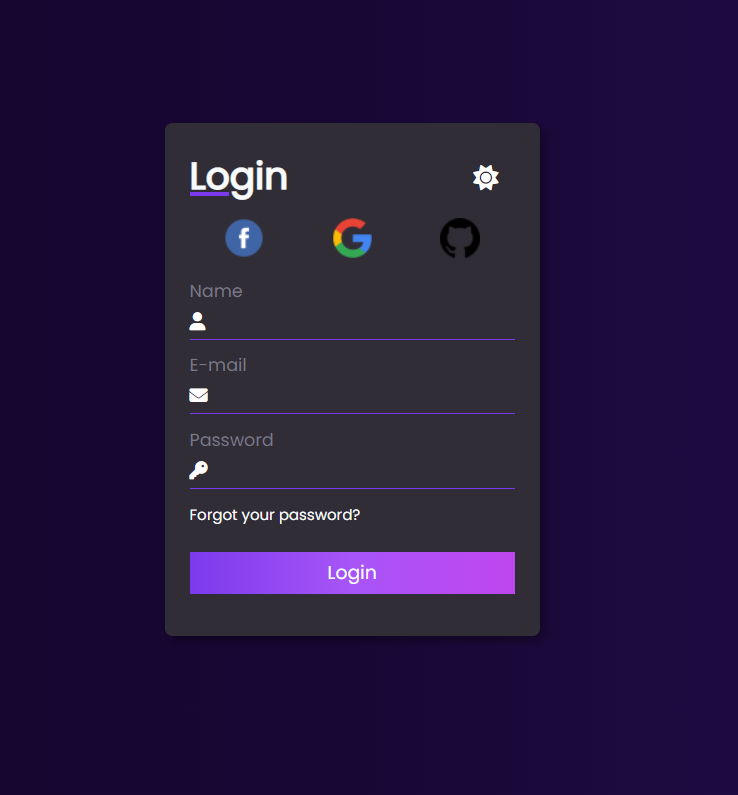

# Registration Form - Dark/Light Mode
This is a simple registration form project made with HTML, CSS and JavaScript. It has the functionality to switch between light and dark display modes.

## Features
Filling in data: The form allows the user to enter basic information such as name, e-mail and password.
Viewing mode toggle: The form includes a toggle button to switch between light and dark viewing modes.

## View Mode
The project includes a feature for switching between light and dark viewing mode. By clicking on the toggle button, the form theme will change according to the selected mode.

## Contribution
Contributions are welcome! If you encounter any problems or have suggestions for improving this project, feel free to open an issue or send a pull request.

## License
This project is licensed under the MIT License. Feel free to use it and modify it according to your needs.

## Contact
If you have any questions or need to get in touch, you can find me at:

Email: belacartaxo@gmail.com

GitHub: belacartaxo
